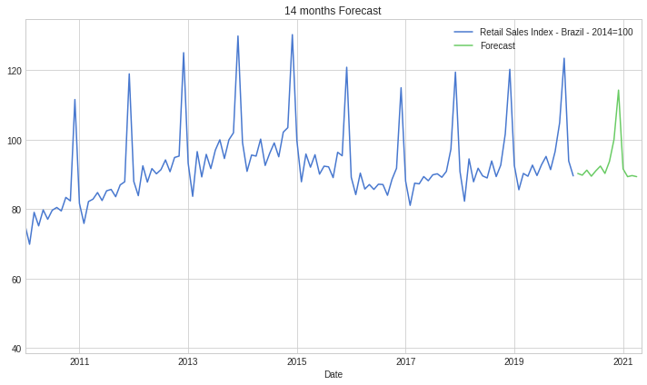

## Modelo Long Short-Term Memory (LSTM) para Pesquisa Mensal do Comércio (PMC)

Este repositório aplica uma rede neural recorrente (RNN) através de um modelo LSTM para tentar prever o comportamente da Pesquisa Mensal do Comércio fornecida pelo IBGE

```A recurrent neural network (RNN) is a class of artificial neural networks where connections between nodes form a directed graph along a temporal sequence. This allows it to exhibit temporal dynamic behavior. Derived from feedforward neural networks, RNNs can use their internal state (memory) to process variable length sequences of inputs.```

```A Pesquisa Mensal de Comércio produz indicadores que permitem acompanhar o comportamento conjuntural do comércio varejista no País, investigando a receita bruta de revenda nas empresas formalmente constituídas, com 20 ou mais pessoas ocupadas, e cuja atividade principal é o comércio varejista.```

## Resultados

### Série histórica da PMC


### Prevendo 24 meses com controle de validação


### Previsão para futuro sem controle de validação

O modelo conseguiu capturar a sazonalidade da série história na previsão para o futuro. 


